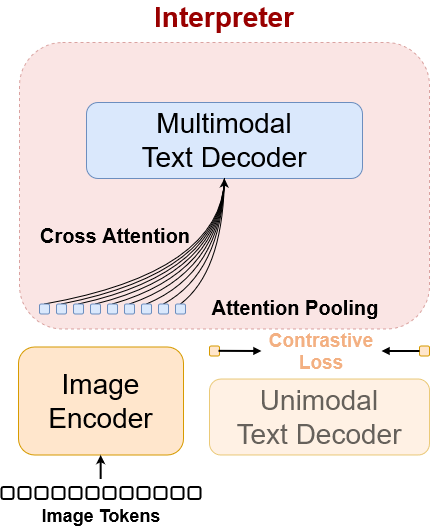
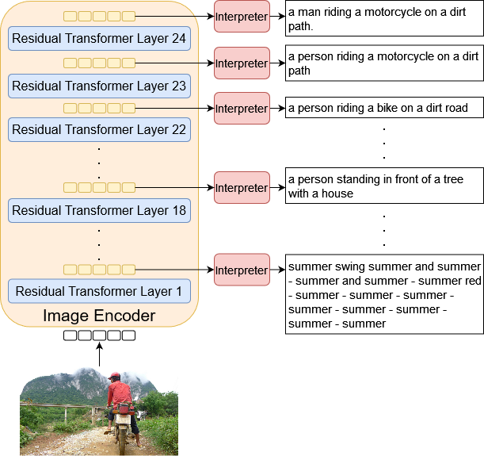

# Visual Latent Captioning - Towards Verbalizing Vision Transformer Encoders
This repository contains the source code for interpreting the intermediate layers of the **vision encoder** component of the [CoCa model](https://arxiv.org/abs/2205.01917). The interpretation leverages the open-source implementation of CoCa by [mlfoundations](https://github.com/mlfoundations/open_clip).

Original CoCa Architecture | Visual latent captioning framework
:-------------------------:|:-------------------------:
  |  
## Overview

- **Objective:**  
  Utilize the model to interpret its internal components through natural language descriptions. This self-interpretation is achieved by passing visual features from every layer through cross-attention within the multimodal text decoder of the same model to generated captions per layer. \
  The generated captions are then further analysized and categorized into visually detectable features and attributes by the use of a large language model. This will allow to get an insite about learned information within the vision encoder at different layers. 

- **Components:**
  - **Vision Encoder:** Extracts visual features from input images at every layer.
  - **Multimodal Text Decoder:** Verbalizes the extracted visual features at every layer.
  - **Large Language Model:** Categorizes the generated interpretations into visually detectable attributes.

## Workflow

- **Visual Features Extraction of Intermediate Layers:**  
  Use the vision encoder to obtain intermediate visual representations from input data.

- **Natural Language Insights:**  
  - Generate human-readable explanations of visual feature representations by passing the extracted features through cross-attention layers in the multimodal text decoder of the same model.
  - Categorize the generated interpretation for deeper insite into learned information within the layers of the vision encoder using a large language model.

## Limitations

- **Architecture Dependency:**  
  This approach is currently limited to multimodal architectures that include a multimodal text decoder.

## Getting Started

To get started with this repository, follow these steps:

1. **Clone the Repository:** 
    ```bash
    git clone https://github.com/SogolHaghighat/latent_verbalizer.git
    ```

2. **Install Dependencies:**\
Create and activate a python or conda environment with python>=3.10.
    ```bash
    cd latent_verbalizer
    pip install torch torchvision --index-url https://download.pytorch.org/whl/cu118
    pip install .
    ```
3. **Prepare the data:** \
To reproduce the results get access to MSCOCO Karpathy test split (5k samples) and store the webdataset format under data. We stored the data in 5 webdataset shards with 1000 sample per shard. The batch size is limited to the GPU memory for batch processing, and the number of epochs is then calculated accordingly. 

4. **Interpretation:**\
Refer to latent_verbalizer/demo.ipynb for an interactive example of the framework. For reproducing the results follow these steps:
    ```bash
    python latent_verbalizer/extract_layer_features_coca.py --dataset "data/{000000..000004}.tar" \
                                                            --sample-per-shards 1000 \
                                                            --batch-size 500 \
                                                            --epochs 10 \
                                                            --model "coca_ViT-L-14" \
                                                            --pretrained "mscoco_finetuned_laion2B-s13B-b90k" \
                                                            --num-layers 24 \
                                                            --output "data/interpret"
    ```

    ```bash
    python latent_verbalizer/generate_layers_captions_coca.py --config latent_verbalizer/interpret.yaml
    ```
  
5. **Categorization:**\
Create and activate a new python or conda environment with python>=3.11. Acquire access to [Llama-3.1-70B-Instruct](https://huggingface.co/meta-llama/Llama-3.1-70B-Instruct) and store the model under models. Prepare the environment as below and run the categorization script:
    ```bash
    pip install torch --index-url https://download.pytorch.org/whl/cu118
    pip install "transformers==4.46.2"
    pip install "accelerate>=0.26.0"
    python latent_verbalizer/categorization_using_Llama.py --token <provide your HF access token to llama model>
    ``` 


## References

- [CoCa: Contrastive Captioners are Image-Text Foundation Models](https://arxiv.org/abs/2205.01917)  
  
- [mlfoundations/open_clip](https://github.com/mlfoundations/open_clip)  

- [LlaMa](https://huggingface.co/meta-llama/Llama-3.1-70B-Instruct)

- [MSCOCO Karpathy split](https://arxiv.org/pdf/1412.2306)

## Contributing

Contributions are welcome! Please open an issue or submit a pull request for any enhancements or bug fixes.

## License

This project is licensed under the [MIT License](LICENSE). 
